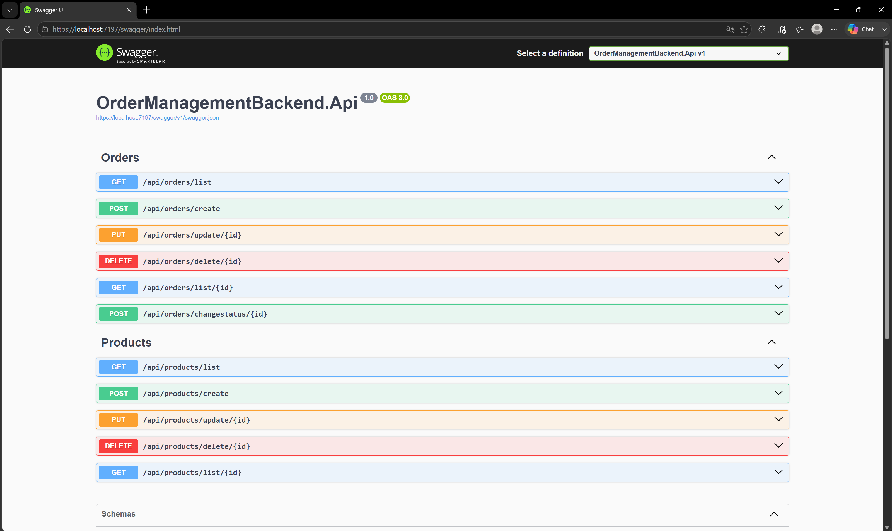

# Order Management — Backend API

> REST API for order and product management, built in .NET 8 with Clean Architecture — technical test project.



---

## 🧩 Problem / Context

Technical test that asks for an order management system: create/edit/delete orders, attach products with quantity and price, and change their status (`Pending` → `InProgress` → `Completed`), with the rule that a `Completed` order can no longer be modified. The spec allowed Express/Node as the base stack, with .NET Core as a bonus track — .NET 8 was chosen directly to showcase Clean Architecture, SOLID, and production-grade API practices.

---

## 🛠️ Stack

| Layer           | Technology       |
|-----------------|------------------|
| Backend         | .NET 8 / ASP.NET Core Web API |
| ORM             | Entity Framework Core 8 + Pomelo.EntityFrameworkCore.MySql |
| Database        | MySQL |
| Validation      | FluentValidation |
| Mapping         | AutoMapper |
| Logging         | Serilog (structured JSON to console + automatic request logging) |
| Auth            | None (explicit requirement from the spec — endpoints have no login/token) |
| Testing         | xUnit + Moq (15 unit tests covering business rules) |

---

## 🏗️ Architecture

Clean Architecture across 4 projects, with the dependency rule always pointing inward:

```
Domain          → no dependencies (entities, repository interfaces, domain exceptions)
Application     → depends only on Domain (services, DTOs, FluentValidation validators)
Infrastructure  → depends only on Domain (EF Core, repositories, DbContext)
Api             → depends on Application + Infrastructure (composition root)
```

- **Repository Pattern** (`IOrderRepository`/`IProductRepository`) to isolate data access from the rest of the layers.
- **Automatic auditing**: `IAuditableEntity` interface (`CreatedAt`/`UpdatedAt`/`CreatedBy`/`UpdatedBy`) stamped centrally in `OrdersContext.SaveChanges`, instead of repeating the logic in every service.
- **Unified error handling with `ProblemDetails`** (RFC 7807): a native .NET 8 `IExceptionHandler` translates domain exceptions (`BusinessRuleException`) to 409, and any unexpected error to 500 without leaking internal details to the client.
- **Centralized validation**: a global `ValidationFilter` automatically resolves the matching FluentValidation validator for each request, without repeating `ValidateAsync` in every endpoint.
- **Pagination + filtering** on the list endpoints (`GetOrders` by `Status`, `GetProducts` by `Name`), with a page size cap to prevent unbounded responses.

Database schema, relationships, and migration history: [docs/database.md](docs/database.md).

---

## 🧠 Technical challenges and decisions

- **Problem:** `Application` referenced `Infrastructure` directly, violating Clean Architecture's dependency rule (even though nothing from it was actually used in code). → **Solution:** the project reference was changed so `Application` depends on `Domain` directly. → **Why:** Dependency Inversion — inner layers can't depend on outer ones, not even by accident.

- **Problem:** business rules (e.g. "don't modify a `Completed` order") were thrown as `InvalidOperationException`, a generic BCL type also used by the runtime for completely unrelated cases — any real bug that happened to throw that same type would have been "disguised" as a business rule and leaked its internal message to the client. → **Solution:** a dedicated domain exception (`BusinessRuleException`), caught specifically by an `IExceptionHandler` that maps it to 409, leaving 500 only for genuinely unexpected errors. → **Why:** separate "we rejected this on purpose" from "this broke".

- **Problem:** editing an order deleted and recreated all of its `OrderProduct` rows (`Clear()` + a brand-new list), which reset their real creation date on every edit. → **Solution:** diff by `ProductId` — existing items are updated in place, new ones are added, and removed ones are taken out. → **Why:** preserve accurate audit data without sacrificing the simplicity of the endpoint.

- **Problem:** the MySQL connection string (with real username and password) was committed in `appsettings.json`. → **Solution:** it was untracked from the repo, `appsettings.example.json` was added as a secret-free template, and the real value now lives in User Secrets (development) or environment variables (production). → **Why:** remove the secret from version control without breaking the workflow for anyone who clones the repo.

---

## 🚀 Getting started

Requirements: .NET 8 SDK, MySQL running locally.

```bash
git clone git@github.com:Carlou134/TaskManagerBackend.git
cd TaskManagerBackend

# Set up your local connection string (not committed)
cp OrderManagementBackend.Api/appsettings.example.json OrderManagementBackend.Api/appsettings.Development.json
# Edit appsettings.Development.json with your local MySQL credentials

# Apply the migrations
dotnet ef database update --project OrderManagementBackend.Infrastructure --startup-project OrderManagementBackend.Api

# Run the API
dotnet run --project OrderManagementBackend.Api
```

The API becomes available at `https://localhost:7197` (or whatever port your `launchSettings.json` profile assigns), with Swagger at `/swagger`.

### Running it in Visual Studio

1. Open `OrderManagementBackend.Api.sln` with Visual Studio.
2. Repeat the local connection string step: copy `OrderManagementBackend.Api/appsettings.example.json` to `OrderManagementBackend.Api/appsettings.Development.json` and fill in your MySQL credentials.
3. Apply the migrations from the **Package Manager Console** (`Tools > NuGet Package Manager > Package Manager Console`), with `OrderManagementBackend.Infrastructure` as the *Default project*:
   ```powershell
   Update-Database -Project OrderManagementBackend.Infrastructure -StartupProject OrderManagementBackend.Api
   ```
4. Select the `https` (or `http`) launch profile from the toolbar dropdown and press **F5** — it opens the browser straight into Swagger.

---

## 🔗 Related links

Frontend: https://github.com/Carlou134/OrderManagementFrontEnd
