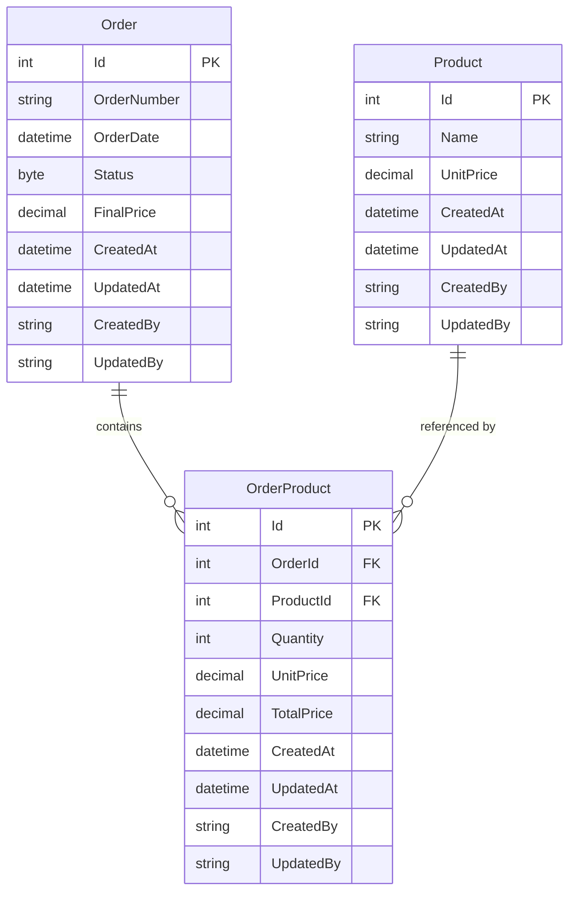

# Database

MySQL 8, mapped with EF Core 8 (`OrdersContext`). The model has 3 tables: `Order`, `Product`, and `OrderProduct` as an enriched junction table (not a plain join table).

## ER diagram

## Entities

### Order
- `OrderNumber`: `varchar(10)`, required.
- `Status`: enum (`Pending = 0`, `InProgress = 1`, `Completed = 2`), persisted as `byte`.
- `FinalPrice`: `decimal(10,2)`, the sum of the order's `OrderProduct.TotalPrice`. It's calculated and persisted in the service layer (`OrderService.CreateOrder` / `UpdateOrder`), not computed on-the-fly with a `SUM` on every read.

### Product
- `Name`: `varchar(50)`, required.
- `UnitPrice`: `decimal(10,2)`, current catalog price.
- Has seed data (`ProductConfiguration.HasData`): 3 products loaded via migration so the project starts with test data with no manual steps.

### OrderProduct (junction table)
Not just a join table with `OrderId` + `ProductId`. It also stores:
- `Quantity`
- `UnitPrice`: the product's price copied at the moment the line is created/edited.
- `TotalPrice`: `Quantity × UnitPrice`, persisted.

**Why:** if `OrderProduct` only held the FKs and the total were computed at read time by joining against `Product.UnitPrice`, an old order's total would drift just because today's catalog price changed. By storing `UnitPrice`/`TotalPrice` on the row, the order's total stays fixed as of the moment of the operation.

**Important nuance:** this is NOT a full price history over time. In `UpdateOrder`, when a `Pending`/`InProgress` order is edited, each line's `UnitPrice` is **re-copied** from the current `Product.UnitPrice` at that moment (see `OrderService.cs:120`). So the price stays frozen between edits, but each edit re-syncs it against the current catalog — it's a "snapshot at the time of the operation," not a "price frozen for life."

## Relationships

- `Order 1 — N OrderProduct`, `Product 1 — N OrderProduct`.
- Both FKs use `DeleteBehavior.Cascade`: deleting an `Order` deletes its `OrderProduct` rows; deleting a `Product` deletes the order lines that reference it. (Note: `DeleteOrder` in the service already blocks deleting `Completed` orders at the business-rule level — the cascade on `Product` is the only real physical delete EF triggers here.)

## Auditing

All three tables implement `IAuditableEntity` (`CreatedAt`, `UpdatedAt`, `CreatedBy`, `UpdatedBy`). Stamping is automatic and centralized in `OrdersContext.SaveChanges`/`SaveChangesAsync` — it walks the `ChangeTracker` and fills these fields based on `EntityState` (`Added` → `CreatedAt`/`CreatedBy`; `Modified` → `UpdatedAt`/`UpdatedBy`), pulling the user from `ICurrentUserProvider`. No service fills these fields by hand.

`CreatedAt` also has `DEFAULT CURRENT_TIMESTAMP(6)` at the MySQL column level, as a safety net in case any insert happens outside this `DbContext`.

## Migrations

| Migration | What it did |
|---|---|
| `InitialCreate` (2026-01-16) | Base schema: `Order`, `Product`, `OrderProduct` with their relationships and the product seed data. |
| `testDespliegue` (2026-01-16) | Empty migration (no-op `Up`/`Down`), used to validate the deployment pipeline. Doesn't change the schema. |
| `AddAuditFields` (2026-07-29) | Added `CreatedAt`/`UpdatedAt`/`CreatedBy`/`UpdatedBy` to all 3 tables when `IAuditableEntity` was introduced. |
